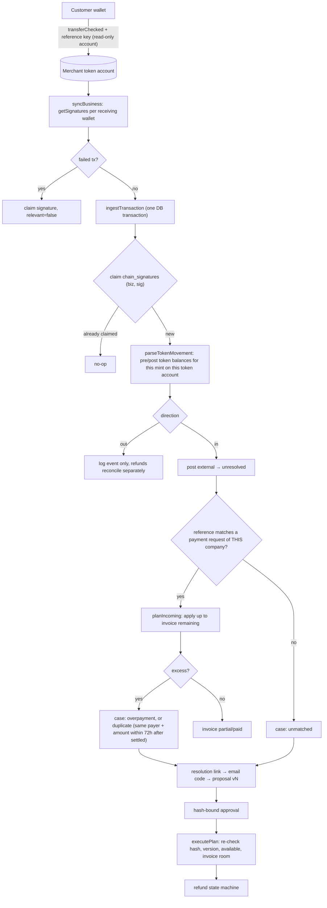
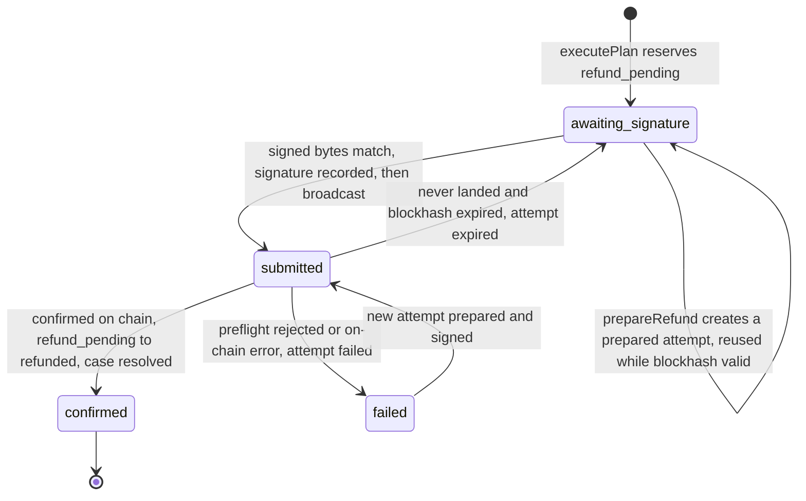

# PayFix architecture (M7)

Updated Oct 5, 2026 for `main` with production mode (PR #8) and the audit fixes (PR #9).

## Components

| Layer | Where | Notes |
| --- | --- | --- |
| Web app | `src/app` (Next.js 16 App Router, React 19) | Business workspace `/app/*`; customer pages `/pay/[invoiceId]`, `/r/[token]`, `/receipt/[caseId]`; server actions in `src/app/actions/{auth,business,public}.ts`; API routes `/api/sync`, `/api/export/ledger`, `/api/dev/inbox` |
| Services | `src/lib/server` | `ingest` (chain → ledger), `resolution` (links, proposals, approvals, execution), `refunds` (prepare, submit, reconcile), `credit`, `auth` (email codes, sessions), `workspaces` (companies, teams, reset), `demo` (devnet demo wallets, faucet). Services take `{ db, chain }`. |
| Pure domain | `src/lib/domain` | `allocation.planIncoming`, `ledger` postings, `proposal` validation and hashing. No I/O. |
| Solana helpers | `src/lib/solana` | Transaction builders (`tx.ts`), balance-based transfer parsing (`parse.ts`), wallet-signature proofs (`proof.ts`). Isomorphic, with no secrets. |
| Chain client | `src/lib/server/chain.ts` | A narrow `ChainClient` interface. `rpcChain` talks to devnet RPC at `confirmed` commitment. `SimChain` is an in-process simulator used by tests and the zero-config mode. |
| Database | `src/lib/db` (Drizzle) | Postgres (Docker locally, Neon on Vercel) or embedded PGlite. Migrations in `drizzle/` apply on first use. |

There are no background workers. Open pages poll `POST /api/sync?b=<businessId>` every ~4 s. `syncCompany` throttles this to one run per company every ~2.5 s per process, then ingests new signatures and reconciles submitted refunds.

## Data model (main tables)

- **Parties:** `businesses` (active `wallet_address`, `mint`), `users`, `memberships` (role), `business_wallets` (all receiving wallets, plus encrypted demo keys), `customers`.
- **Billing:** `invoices` (amount in base units), `payment_requests` (one unique Solana Pay `reference` per payment attempt).
- **Chain:** `chain_signatures` (PK `(business_id, signature)`, every signature seen), `transfers` (unique `(business_id, signature)`, direction, amount, counterparty, reference, invoice, flags).
- **Resolution:** `cases` (kind, status), `case_transfers`, `resolution_links` (SHA-256 token hash, `expires_at`, `revoked_at`), `proposals` (immutable versions: lines, destination, proof, available, hash, status), `approvals` (proposal hash, invalidation).
- **Refunds:** `refunds` (unique per proposal; source wallet, destination, status), `refund_attempts` (exact message, blockhash, last valid height, signature; partial unique index `refund_attempts_one_active`).
- **Ledger:** `journal_entries` (unique `idempotency_key`), `postings` (account, signed amount, plus transfer/invoice/customer/refund/case dimensions).
- **Activity/auth:** `events` (timeline; also the source of notifications — `actor_user_id` hides a member's own actions, `dedupe_key` makes once-only events like `overdue:<invoice>` idempotent), `notification_reads` (per-member read marks; `memberships.notifications_read_at` is the "mark all read" cursor and `memberships.notification_muted` the categories a member turned off), `otp_codes` (HMAC'd, 10-min TTL, 5 attempts), `sessions` (hashed tokens, 7 days), `outbox` (emails; shown in the demo inbox).

## Double-entry ledger

All money is `bigint` base units (the test token has 6 decimals). Every write goes through `postEntry` (`src/lib/server/journal.ts`):

- `assertBalanced`: postings sum to exactly zero, and there is at least one posting.
- `INSERT … ON CONFLICT (idempotency_key) DO NOTHING`. A reused key writes nothing and returns `false`.

Accounts: `external`, `unresolved`, `invoice`, `credit`, `refund_pending`, `refunded`. Money enters only through `external → unresolved` when a verified transfer arrives. After that it moves only between internal accounts:

| Event | Posting | Idempotency key |
| --- | --- | --- |
| Transfer received | `external → unresolved` | `receipt:<biz>:<signature>` |
| Applied to referenced invoice | `unresolved → invoice` | `apply:<biz>:<signature>` |
| Plan executed | `unresolved → invoice / credit / refund_pending` (drawn oldest-first from the case's transfers) | `execute:<proposalId>` |
| Refund confirmed | `refund_pending → refunded` | `refund-confirmed:<refundId>` |
| Credit applied | `credit → invoice` (under a row lock on the customer) | `credit-apply:<random>` |

Invariant: **received = invoice + credit + refund_pending + refunded + unresolved**. The tests assert this (`domain.test.ts` "ledger", `flow.test.ts`, `workspaces.test.ts`).

## Payment ingestion and idempotency

- **Verification.** The amount is the net change of the configured mint on the business's own associated token account, taken from `meta.preTokenBalances` / `postTokenBalances` and not from instruction data. Transactions with `meta.err` are skipped. Reads use `confirmed` commitment. The recipient is implicit, because only the business's token accounts are queried.
- **Matching.** It uses the reference key only, never the amount. References are looked up within the same `business_id`, so a reference from another company never matches.
- **Idempotency.** The signature claim, the transfer insert, and the keyed postings happen in one DB transaction. Re-syncs, concurrent tabs, and restarts are no-ops. A reset keeps `chain_signatures` so old payments aren't re-imported.

## Proposals and approvals

- The customer submits lines: `invoice` (an open invoice of the same customer, at most once each, at most its remaining balance), at most one `credit`, and at most one `refund`. The lines must sum to exactly the case's available unresolved amount.
- A refund needs a destination that is a valid on-curve address, **and** a signature from that wallet over a PayFix message naming the case, the destination, and a nonce (`solana/proof.ts`). This proves the customer controls it, which rules out an exchange deposit address.
- `hashProposal` is the SHA-256 of canonical JSON: case ID, version, available amount, sorted lines in base units, and destination. Line order doesn't change the hash.
- Each submission inserts a new version. The previous `submitted`/`approved` version becomes `superseded`, and its approval gets `invalidated_at` plus a human-readable reason ("Superseded by v2: Refund destination changed…").
- `approveProposal` approves only the latest `submitted` version and re-computes its hash.
- `requestChanges` lets the business decline a version with a note. The business never edits the customer's plan.
- `executePlan` runs under `SELECT … FOR UPDATE` on the case. It requires that the case is `approved`, the latest version is approved, and an active approval's hash equals the stored hash and the recomputed hash. It also requires that the unresolved amount still equals the version's `available`, and that every invoice still has room.

## Refund state machine

- The server builds the exact transaction: create the destination ATA if needed, `transferChecked` from the wallet that received the excess, and memo `payfix:refund:<refundId>`. The business wallet signs it, either in the browser wallet or with a server-held devnet key in demo mode.
- `submitSignedRefund` rejects bytes whose message differs from the prepared one. It marks the attempt `submitted` and stores the signature **before** broadcasting. An ambiguous broadcast error is left for reconciliation.
- At most one `prepared`/`submitted` attempt per refund (partial unique index). A new attempt is offered only after confirmed failure or blockhash expiry.

## Multi-tenant isolation and roles

- Every business query is scoped by `business_id`. Case actions load the case with `businessId = session company`.
- Roles: `viewer < editor < owner` (`src/lib/roles.ts`). `requireRole` runs in every business server action:
  - **owner:** team, wallets, reset.
  - **editor:** customers, invoices, credit, links, approve, request changes, execute, sign refunds.
  - **viewer:** sync, refund status checks, ledger export.
  - The UI also hides controls by role.
  - `src/app/actions/business.test.ts` calls each editor and owner action as a lower role and checks it is refused without writing anything.
- Customers have no account. A resolution link is a 32-character random token stored as a SHA-256 hash, valid for 7 days, and revoked when a new one is sent. It only opens a page; the customer must also verify with an email code sent to the address on file. Every customer action (`authorizedCase`) re-checks that the session customer equals the link's customer.
- Demo inbox (`/api/dev/inbox`, demo mode only) shows mail for the signed-in user's companies, or for the address this browser requested a code for.
- Payment pages are capability URLs: the invoice ID is unguessable, and the page can only pay the business.
- `/api/sync` only syncs a company the caller can already see: a member's company (`?b=`, session checked), a public pay link's invoice (`?invoice=`), or a live resolution link (`?link=`). Anything else gets 404.

## Production safeguards

Demo and production are two deployments of the same code, configured by environment (see README "Production deployment").

- **Email:** `queueEmail` writes to `outbox` inside the same transaction as the change; `deliverOutbox` sends through Resend after commit, retries up to 5 times, and erases the code and link once sent. Demo mode keeps mail in the in-app demo inbox.
- **Rate limits:** `rate_events` rows counted over a sliding window (`src/lib/server/ratelimit.ts`), keyed by hashed email/IP/wallet: sign-in codes, the devnet faucet, and demo company creation.
- **Receiving wallets:** outside demo mode, adding a wallet requires a fresh signature from it (`assertWalletOwnership`), so a mistyped address can't receive payments.
- **Mainnet config:** defaults to Circle's USDC; startup refuses demo mode and the default session secret on mainnet.
- **Headers and health:** no framing, HSTS, nosniff; `GET /api/health` reports database status and the function/database regions.

## Solana's role

1. **Verified incoming payments.** Each payment attempt gets a fresh reference public key, attached as a read-only account per the Solana Pay spec. PayFix finds the payment by signatures on its own token account and reads the amount from token-balance deltas. Only the random reference and the amount are on chain; invoice details stay off chain.
2. **Merchant-signed refunds.** The refund is a normal SPL `transferChecked` signed by the business's own wallet. PayFix never holds production keys; in demo mode it holds devnet keys only. Confirmation status and blockhash expiry give a definite outcome before any retry.

Fast finality and low fees make it practical to settle a $40 refund and verify it within the demo. The design doesn't depend on custom on-chain programs.
